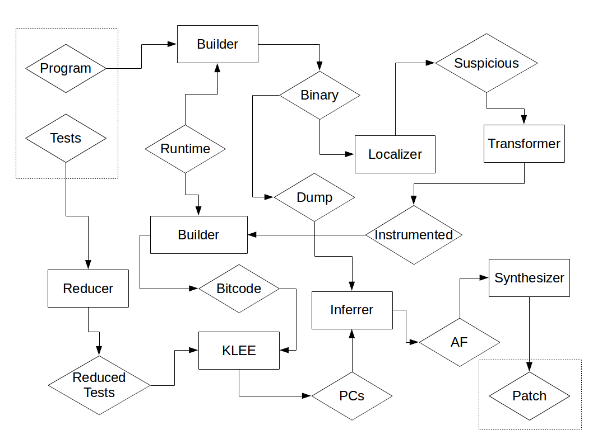

# Manual

## Table of contents ##

* [Introduction](#introduction)
* [Build System](#build-system)
* [Test Abstraction](#test-abstraction)
  * [Instrumentation](#instrumentation)
  * [Running](#running)
  * [Expected output](#expected-output)
* [Defect Classes](#defect-classes)
  * [Expressions](#expressions)
  * [Statements](#statements)
* [Synthesis Levels](#synthesis-levels)
* [SemFix](#semfix)
* [Configuration](#configuration)

## Introduction ##

Angelix uses symbolic execution and program synthesis to search for a patch. It can add guards for program statements and modify simple program expressions. To analyze program test executions, Angelix requires interface to test running and test assertions.

## Build System ##

Angelix is designed to support Makefile-based projects. The following is required for successful execution:

* Compiler used by the build system can be substituted by redefining `CC` environment variable.
* Compilation and linking are done by separate compiler calls.
* Project is configured to use static linking.
* All executables and object files are removed (e.g. run `make clean`).
* Angelix environment is activated (`source /path/to/angelix/activate`).

Angelix is hygienic (it does not modify original project files), however, it also assumes that the source code only uses relative references to the source tree. All intermediate data is stored in the `.angelix` directory.

## Test Abstraction ##

Real-world C programs use various test frameworks. Often testing scenarious are expressed using a combination of small C programs and Bash/Perl scripts. Angelix requires extracting expected outputs from tests to perform semantics analysis. To do so, it provides a test framework abstraction that can be injected into exising test harness.

To abstract over test framework, Angelix require the following:

* Instrument output expressions in the source code of the buggy program
* Adjust test running configuration
* Specify expected output values for the instrumented expressions

### Instrumentation ###

Angelix requires specifying output expressions in the source code of the subject program. Consider a simple example:

    #include <stdio.h>

    int main(int argc, char** argv) {
        int x, y, z;
        x = atoi(argv[1]);
        y = atoi(argv[2]);
        z = x + y;
        if (z < 0) {
            printf("Error\n");
        }
        printf("%d\n", z + 1);
        return 0;
    }

Output expressions are wrapped with `ANGELIX_OUTPUT` macro providing their type and label. Reachibility can be captured using `ANGELIX_REACHABLE` macro with label. You also need to provide default definitions for these macros, so that the program remains compilable:

    #include <stdio.h>

    #ifndef ANGELIX_OUTPUT
    #define ANGELIX_OUTPUT(type, expr, label) expr
    #define ANGELIX_REACHABLE(label)
    #endif

    int main(int argc, char** argv) {
        int x, y, z;
        x = atoi(argv[1]);
        y = atoi(argv[2]);
        z = x + y;
        if (z < 0) {
            ANGELIX_REACHABLE("error");
            printf("Error\n");
        }
        printf("%d\n", ANGELIX_OUTPUT(int, z + 1, "stdout"));
        return 0;
    }

The following types of output expressions are supported:

* int
* long
* bool
* char
* str (null-terminated string)

### Running ###

To provide interface to test runner, we use the notion of oracle executable. It takes a test identifier as the only argument, runs the corresponding test and terminates with `0` exit code if and only if the test passes.

Oracle executes bug-reproducing binary using _angelix run command_ stored in `ANGELIX_RUN` environment variable, if it is defined. Each test must include at most one execution of angelix run command. This is an example of an oracle script:

    #!/bin/bash

    case "$1" in
        test1)
            ${ANGELIX_RUN:-eval} ./test 1 2
            ;;
        test2)
            ${ANGELIX_RUN:-eval} ./test 0 -1
            ;;
    ...

Oracle is executed from the root of a copy of the source code directory, therefore all references to the source tree must be relative to the root of the source tree.

### Expected output ###

To specify expected outputs values for instrumented expression, we use an assert file. Outputs are specified in JSON format:

    {
        "test1": {
            "stdout": [4]
            },
        "test2": {
            "stdout": [0],
            "reachable": ["error"]
        }
        ...
    }

Each output label corresponds to a list of values since an expression can be evaluated multiple times during test execution. `reachable` is a special label for capturing reachibility property and corresponding values include labels that are executed at least once. An empty list for a label means that the corresponding expression (or location) must not be executed, while the absence of a label in the test specification means that any values are allowed.

It is often difficult to define correct values for an arbitrary program expression. For this reason, Angelix can extract such values automatically from program runs for passing test cases, and from golden version's runs for failing test cases if it is available. When using golden version, it must be instrumented accordingly.

Note that when values are extracted from program runs, the value of the label `reachable` is empty list by default, as opposite to other labels that are not present in the specification if not executed.

## Defect Classes ##

Angelix supports the following defect classes:

* if-conditions
* loop-conditions
* assignments
* guards

### Expressions ###

Classes "if-conditions", "loop-conditions" and "assignments" correspond to modifications of _repairable_ expressions. Repairable expressions are defined in the following way:

1. Integer and pointer variables, integer and character literals, member expressions are repairable.
2. If x and y are repairable expressions, then so are `x == y`, `x != y`, `x <= y`, `x >= y`, `x > y`, `x < y`, `x + y`, `x - y`, `x * y`, `x / y`, `x || y`, `x && y`, `!x`.
3. An expression is repairable if it can be shown to be repairable on the basis of conditions 1 and 2.

#### if-conditions ####

This defect class includes modifications of all repairable if conditions or if whole if condition is not repairable, then all its repairable disjuncts and conjuncts.

#### loop-conditions ####

Same as if-conditions, but for while loops and for loops. Note that this defect class can considerably increase the search space and usually requires setting KLEE forks bound (`--klee-max-forks`).

#### assignments ####

Modifications of all repairable right-hand-sides of assignments, where an assignment is a binary operation with operator `=` and also an immediate child of a block statement.

### Statements ###

Class "guards" corresponds to statement-level modifications.

#### guards ####

Transformations from `S;` to `if (E) { S; }` where `E` is a synthesized expression and `S` is an assignments or a function call and also an immediate child of a block statement.

## Synthesis Levels ##

Synthesis levels are sets of primitive components that are used to repair buggy program expressions. Angelix provides the following levels:

* alternatives
* integer-constants
* boolean-constants
* variables
* basic-arithmetic
* basic-logic
* basic-inequalities
* extended-arithmetic
* extended-logic
* extended-inequalities
* mixed-conditional
* conditional-arithmetic

### alternatives ###

Additinal components similar to existing ones:

Existing  | Additional
--------- | ----------
`||`      | `&&`
`&&`      | `||`
`==`      | `!=`
`!=`      | `==`
`<`       | `<=`
`<=`      | `<`
`>`       | `>=`
`>=`      | `>`
`+`       | `-`
`-`       | `+`

### integer-constants ###

Additional integer constant.

### boolean-constants ###

Additional boolean constant.

### variables ###

Visible variables.

### basic-arithmetic ###

Additional integer constant, `+`, `-`.

### basic-logic ###

Additional int-to-bool converter, `||`, `&&`.

### basic-inequalities ###

Additional integer constant, `=`, `>`, `>=`.

### extended-arithmetic ###

Additional visible variables, integer constant, `+`, `-`.

### extended-logic ###

Additional visible variables, int-to-bool converter, `||`, `&&`.

### extended-inequalities ###

Additional visible variables, integer constant, `=`, `>`, `>=`.

### mixed-conditional ###

Additional visible variables, integer constant, `>`, `>=`, `||`, `&&`, `+`, `-`.

### conditional-arithmetic ###

Additional visible variables, integer constant, `>`, `>=`, `+`, `-`, `ite`.

## SemFix ##

SemFix is a predecessor of Angelix. Taking advantage of the modular design of Angelix, we incorporated the algorithm of SemFix into Angelix. To download and build SemFix dependencies, execute `make semfix`, to verify your installation, run `make test-semfix`. After installation, SemFix can be activated using the `--semfix` option of Angelix.

## Configuration ##

Default Angelix configuration corresponds to a very narrow repair search space. Typically, you need to specify defect classes, synthesis levels and bounds for symbolic execution and program synthesis. The values of the paramenters depends on the size and the structure of your subject programs. 

Run `angelix --help` to see the list of available options. You can find example configurations for small programs in `tests/tests.py` of Angelix distribution and in `options.json` file for large programs in ICSE'16 experiments [scripts](http://www.comp.nus.edu.sg/~release/angelix/angelix-experiments.tar.gz).

An example of configuration is the following:

    --defect if-conditions loop-conditions assignments \
    --synthesis-levels alternatives extended-arithmetic extended-logic extended-inequalities \
    --timeout 3600 \
    --group-size 1 \
    --klee-solver-timeout 20 \
    --klee-timeout 300 \
    --klee-max-forks 200 \
    --synthesis-timeout 100000 \
    --synthesis-global-vars \
    --synthesis-func-params \
    --synthesis-used-vars
